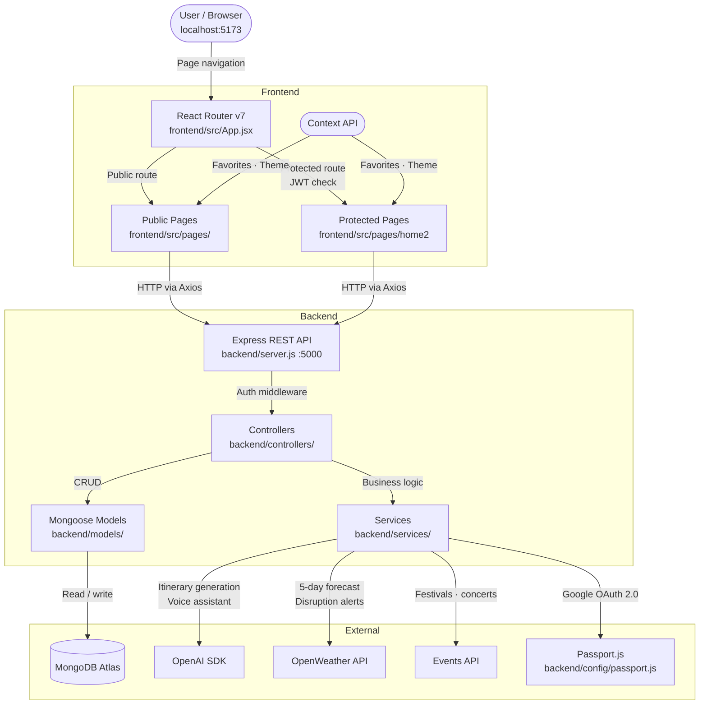

# TourEase — Architecture

This document gives new contributors a quick mental model of how TourEase is structured, how a request flows through the system, and which files to open first.

---

## System Flow

---

## Layer Breakdown

### 1. React Router + App Shell — `frontend/src/App.jsx`
The root of the frontend. Defines all client-side routes and wraps protected routes in a `ProtectedRoute` guard that checks for a valid JWT in `localStorage`. If no token is found, the user is redirected to `/login`. Start here when adding a new page or changing access control.

### 2. Pages — `frontend/src/pages/`
One file per route. Pages are thin: they compose components, call services, and manage local `useState`. Heavy logic does not belong here — push it into services or hooks.

### 3. Components — `frontend/src/components/`
Reusable UI broken into four sub-folders:
- `chatbot/` — AI chatbot widget
- `common/` — shared utilities (Loader, ScrollToTop)
- `features/` — feature-specific sub-components
- `layout/` — page layout wrappers

### 4. Services — `frontend/src/services/`
All HTTP calls go through Axios service modules here. Pages never call `fetch` or `axios` directly — they import from `services/`. This keeps API base URLs, headers, and error handling in one place.

### 5. Context API — `frontend/src/context/`
Two global state providers:
- `FavoritesContext` — persists favourite destinations across pages
- `ThemeContext` — dark/light mode toggle

Auth state is not in Context — it lives in `localStorage` and is read by `ProtectedRoute`.

### 6. Express Server — `backend/server.js`
App bootstrap: registers middleware (CORS, JSON body parser, Passport), mounts all routers, and connects to MongoDB. The request lifecycle is: `CORS → Router → Controller → Service/Model → Response`.

### 7. Controllers — `backend/controllers/`
One controller per domain (auth, trip, itinerary, events, weather, contact). Controllers handle request/response and delegate all business logic to services. Keep controllers thin.

### 8. Services — `backend/services/`
Heavy logic and external API integrations live here: OpenAI calls for itinerary generation, OpenWeather API for forecasts and disruption alerts, Events API for local festivals. Isolating this from controllers makes it easy to mock in tests and swap providers.

### 9. Models — `backend/models/`
Mongoose schemas defining the MongoDB data structures. Each model maps to one collection. Controllers interact with the database only through models — no raw MongoDB driver calls.

### 10. Auth — `backend/config/passport.js` + JWT
Two auth mechanisms run in parallel:
- **JWT** — issued on email/password login, stored in `localStorage`, validated by Express middleware on protected routes.
- **Google OAuth 2.0** — handled by Passport.js; on success issues the same JWT.

---

## Key Files

| File / Folder | What it does |
|---|---|
| `frontend/src/App.jsx` | Route definitions + `ProtectedRoute` guard |
| `frontend/src/pages/` | One component per route |
| `frontend/src/services/` | All Axios HTTP calls |
| `frontend/src/context/` | `FavoritesContext` + `ThemeContext` |
| `backend/server.js` | Express bootstrap — middleware, routers, DB connect |
| `backend/controllers/` | Request/response handlers per domain |
| `backend/services/` | OpenAI, OpenWeather, Events API integrations |
| `backend/models/` | Mongoose schemas |
| `backend/config/passport.js` | Google OAuth 2.0 strategy |
| `backend/config/db.js` | MongoDB Atlas connection |
| `.env.example` | All required environment variables |

---

## Data Flow in Plain English

1. A user opens the app — React Router renders the correct page based on the URL.
2. If the route is protected, `ProtectedRoute` checks `localStorage` for a JWT; no token means redirect to `/login`.
3. A page calls a service function which sends an Axios HTTP request to the Express backend.
4. Express validates the JWT (on protected endpoints), routes the request to the correct controller.
5. The controller calls a service for any external API work (OpenAI, OpenWeather, Events) and a Mongoose model for database reads/writes.
6. The response travels back as JSON to the frontend service, which returns the data to the page for rendering.

---

## Getting Oriented as a New Contributor

1. **Run the app locally first** — follow the Quick Start in `README.md`; both `backend` and `frontend` must be running simultaneously.
2. **Adding a new page?** Create it in `frontend/src/pages/`, add its route in `App.jsx`, and add a service function in `frontend/src/services/` for any API calls.
3. **Adding a new API endpoint?** Add a route in `backend/routes/`, a controller in `backend/controllers/`, and any external API logic in `backend/services/`.
4. **Changing AI or weather behaviour?** That's `backend/services/` — isolated from controllers so it's safe to edit without touching request/response logic.
5. **Auth issues?** Check `backend/config/passport.js` for OAuth and the JWT middleware wired in `backend/server.js`.
6. **Copy `.env.example` to `backend/.env`** and fill in all keys before starting — missing env vars are the most common cause of local setup failures.
